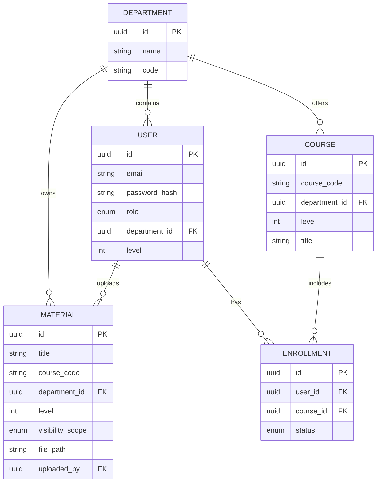

# Database Schema Documentation

## Overview
The database uses PostgreSQL with SQLAlchemy ORM and Alembic migrations. It uses UUIDs for all primary keys to ensure global uniqueness and prevent ID enumeration.

## Tables

### `departments`
Stores academic departments.
- `id`: UUID (PK)
- `name`: String
- `code`: String (Unique, e.g., 'CS', 'BIO')

### `users`
System users (Students, Librarians, Admins).
- `id`: UUID (PK)
- `email`: String (Unique, Indexed)
- `password_hash`: String
- `role`: Enum (student, librarian, admin)
- `department_id`: UUID (FK -> departments)
- `level`: Integer (100, 200, etc.)
- `created_at`: DateTime
- **Indexes**: `(department_id, level)` for fast user filtering within departments.

### `materials`
Library materials (files).
- `id`: UUID (PK)
- `title`: String
- `course_code`: String (Indexed)
- `department_id`: UUID (FK -> departments)
- `level`: Integer
- `visibility_scope`: Enum (LEVEL_ONLY, DEPARTMENT, GLOBAL_SEARCHABLE)
- `file_path`: String
- `uploaded_by`: UUID (FK -> users)
- `created_at`: DateTime
- **Indexes**: `(department_id, level)` for "Shelf View" queries.

### `courses`
Future-ready course definitions.
- `id`: UUID (PK)
- `course_code`: String (Unique)
- `department_id`: UUID (FK -> departments)
- `level`: Integer
- `title`: String

### `enrollments`
Tracks user enrollments in courses.
- `id`: UUID (PK)
- `user_id`: UUID (FK -> users)
- `course_id`: UUID (FK -> courses)
- `status`: Enum (active, carry_over, completed)
- **Indexes**: `(user_id, course_id)` for quick lookup.

## ERD (Diagram)

## Schema Decisions
1. **UUIDs**: Used for all IDs to avoid sequence guessing and ease future distributed scaling.
2. **On Delete Restrict**: Materials and Users are protected from accidental deletion if referenced.
3. **On Delete Cascade**: Enrollments are purged if a user or course is deleted.
4. **Indexing**: Strategic composite indexes on `(department_id, level)` optimize the primary "Shelf View" and metadata retrieval patterns.
